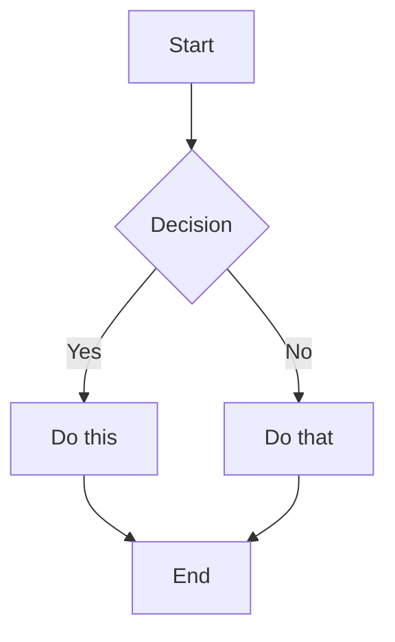

arkdown
# Heading 1: Main Title

This is a paragraph with **bold text**, *italic text*, and ***bold italic text***. You can also have `inline code` and ~~strikethrough~~ text.

## Heading 2: Links and Images

Here's a [link to Google](https://www.google.com) and an email link: <user@example.com>.


### Heading 3: Lists

Unordered list:
- First item
- Second item
  - Nested item 1
  - Nested item 2
    - Deep nested item
- Third item

Ordered list:
1. First step
2. Second step
   1. Sub-step one
   2. Sub-step two
3. Third step

Task list:
- [x] Completed task
- [ ] Incomplete task
- [ ] Another pending task

#### Heading 4: Code Blocks

Python code with syntax highlighting:
```python
def fibonacci(n):
    """Generate Fibonacci sequence up to n"""
    a, b = 0, 1
    result = []
    while a < n:
        result.append(a)
        a, b = b, a + b
    return result

# Test the function
print(fibonacci(100))  # Output: [0, 1, 1, 2, 3, 5, 8, 13, 21, 34, 55, 89]
```

JavaScript code:
```javascript
const greet = (name) => {
    return `Hello, ${name}! Welcome to Markdown preview.`;
};

console.log(greet("Developer"));
// Output: Hello, Developer! Welcome to Markdown preview.
```

Dart code:
```dart
class Person {
  final String name;
  final int age;
  
  Person(this.name, this.age);
  
  void introduce() {
    print('My name is $name and I am $age years old.');
  }
}

void main() {
  final person = Person('John', 30);
  person.introduce();
}
```

##### Heading 5: Blockquotes

> This is a simple blockquote.
> It can span multiple lines.

> **Nested blockquotes:**
>> This is a nested blockquote.
>>> Even deeper nesting!
>>>> How deep can we go?

###### Heading 6: Tables

| Left-aligned | Center-aligned | Right-aligned |
|:-------------|:--------------:|--------------:|
| Cell 1       | Cell 2         | Cell 3        |
| **Bold cell** | *Italic cell*  | `Code cell`   |
| Long content here | Short | 42 |

### Horizontal Rule

Above the line...

---

Below the line...

### Definition Lists (if supported)

Term 1
: Definition for term 1

Term 2
: Definition for term 2
: Another definition for term 2

### Footnotes

Here's a sentence with a footnote reference[^1].

[^1]: This is the footnote content. It appears at the bottom.

### HTML Elements (if supported)

<details>
<summary>Click to expand!</summary>

This content is hidden until you click the summary.

- You can put any markdown here
- Including lists and **formatting**

</details>

<div align="center">
  <b>Centered text using HTML</b>
</div>

### Escaped Characters

\*This is not italic\*  
\`This is not code\`  
\# This is not a heading

### Unicode and Emojis

Mathematical symbols: ∀ ∃ ∈ ∑ ∫ ∞ ≈ ≠ ≤ ≥

Greek letters: α β γ δ ε ζ η θ

Emojis: 😀 🚀 💻 🎉 🔥 ⭐ ✨

### Long Wrapped Text

This is a very long paragraph that demonstrates how the preview handles text wrapping. Lorem ipsum dolor sit amet, consectetur adipiscing elit. Sed do eiusmod tempor incididunt ut labore et dolore magna aliqua. Ut enim ad minim veniam, quis nostrud exercitation ullamco laboris nisi ut aliquip ex ea commodo consequat. Duis aute irure dolor in reprehenderit in voluptate velit esse cillum dolore eu fugiat nulla pariatur. Excepteur sint occaecat cupidatat non proident, sunt in culpa qui officia deserunt mollit anim id est laborum.

### Nested Everything

> #### Quoted Heading
> 
> This is a quote with **bold** and *italic*.
> 
> - Quoted list item 1
> - Quoted list item 2
> 
> ```bash
> echo "Code inside quote"
> ```
> 
> | Table | Inside |
> |-------|--------|
> | Quote | !      |

### Mermaid Diagram (if supported)



### Mathematical Formulas (LaTeX)

Inline math: $E = mc^2$

Block math:
$$
\int_{0}^{\infty} e^{-x^2} dx = \frac{\sqrt{\pi}}{2}
$$

### Colored Text (GitHub-style diffs)

```diff
- This line was removed
+ This line was added
  This line is unchanged
```

### Collapsible Section with Markdown

<details>
<summary><b>Click to see advanced formatting</b></summary>

## This is a heading inside

- List item 1
- List item 2

```rust
fn main() {
    println!("Hello from collapsed section!");
}
```

| A | B |
|---|---|
| 1 | 2 |

</details>

### Final Note

This markdown file contains almost every common markdown element to test your preview functionality. Happy testing! 🎉

